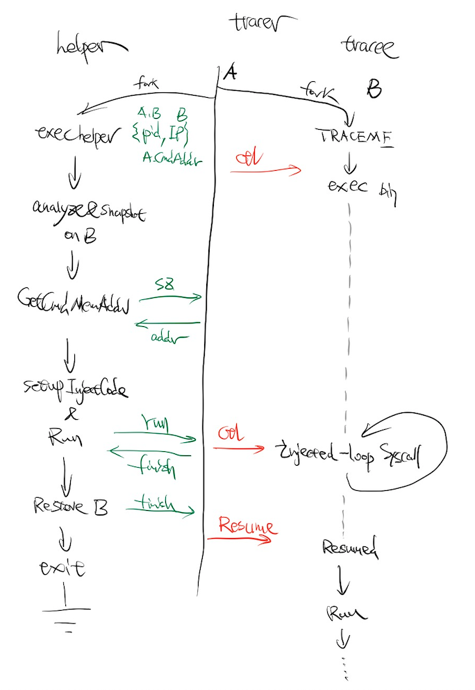

# TiExec

This opensource project is inspired by the [TiDB Hackathon 2021](https://tidb.io/events/hackathon2021). Here is the [RFC](RFC.md) doc of this opensource project (only Chinese version is available currently).

I would like to name this opensource project with a prefix "Ti" to show my sincere respect for the marvelous contributions they have done to the opensource community.

# Status

Prototype is ready. 

You should wait for its v1.0 release if you want to use it in production.

# Synopsis

```bash
$ tiexec echo -e "Hi, I am loaded by tiexec ❤️\nIt may try to make me more performant ☺\n"
Hi, I am loaded by tiexec ❤️
It may try to make me more performant ☺

$ tiexec go version
go version go1.16.4 linux/amd64

$ tiexec rustc -V
rustc 1.55.0 (c8dfcfe04 2021-09-06)

$ tiexec bin/pd-server ...
$ tiexec bin/tidb-server ...
$ tiexec bin/tikv-server ...
$ tiexec bin/tiflash/tiflash ...

$ # or even any elf you like
$ tiexec bin/prometheus/prometheus ...
$ tiexec bin/bin/grafana-server ...
```

# Description

TiExec will try to alleviate the iTLB-Cache-Miss problem of the application it loaded, so it will bring some direct performance improvement to those applications that are being punished by iTLB-Cache-Miss problem. Generally speaking, one program may face such iTLB-Cache-Miss problem if its .text segment is too large. 

For example, the .text segment size of some components in TiDB is from ~46MB to ~160MB, and a test in an OLTP scenario of TiDB with these components optimized by TiExec shows that it could bring about an overall 6-11% performance improvement directly.

# Build and Have a Try

## Build & Setup

```bash
$ cd $ROOT_OF_SRC
$ go build -o tiexec-helper helper.go
$ cd c
$ gcc -I log/ tiexec.c log/log.c -o tiexec
```

Install (need to be root):

```bash
$ mkdir -p /root/.tiexec/bin
$ mkdir -p /root/.tiexec/log
$ cp -f $ROOT_OF_SRC/tiexec-helper /root/.tiexec/bin/
$ cp -f $ROOT_OF_SRC/c/tiexec /root/.tiexec/bin/
```

Setup Env (need to be root):

```bash
$ export PATH=/root/.tiexec/bin:$PATH
# tell kernel to rereserve some hugepages for us
$ echo 500 > /sys/kernel/mm/hugepages/hugepages-2048kB/nr_hugepages
# have a check
$ cat /proc/meminfo | grep -P Huge
AnonHugePages:     49152 kB
HugePages_Total:     500 // <-- success
HugePages_Free:      500 // <-- 500 pages available
HugePages_Rsvd:        0
HugePages_Surp:        0
Hugepagesize:       2048 kB
```

## Have a Try

Run (need to be root):

```bash
$ tiexec echo -e "Hi, I am loaded by tiexec ❤️\n"
Hi, I am loaded by tiexec ❤️
```

Now let's have a try on TiDB-Server:

```bash
$ tiexec ./tidb-server # args is following...
```

Here is the memory maps when `tidb-server` reaches its entry point:

```bash
$ cat /proc/$pid_of_tidb_server/maps
00400000-0579a000 r-xp 00000000 00:2d 370                                /mnt/down/tarball/tidb-server
05999000-060b3000 rw-p 05399000 00:2d 370                                /mnt/down/tarball/tidb-server
... ...
$ cat /proc/$pid_of_tidb_server/numa_maps
00400000 default file=/mnt/down/tarball/tidb-server mapped=21402 active=1 N0=21402 kernelpagesize_kB=4
05999000 default file=/mnt/down/tarball/tidb-server anon=1 dirty=1 N0=1 kernelpagesize_kB=4
... ...
```

We can see that the .text segment of `tidb-server` is very large, ~83.6 MB, and it takes about *21402* * 4KB-pages to map them.

And here is after `tiexec` optimized:

```bash
$ cat /proc/$pid_of_tidb_server/maps
00400000-05600000 r-xp 00000000 00:0e 454903                             /anon_hugepage (deleted)
05600000-0579a000 r-xp 00000000 00:00 0
05999000-060b3000 rw-p 05399000 00:2d 370                                /mnt/down/tarball/tidb-server
... ...
$ cat /proc/$pid_of_tidb_server/numa_maps
00400000 default file=/anon_hugepage\040(deleted) huge anon=41 dirty=41 N0=41 kernelpagesize_kB=2048
05600000 default anon=410 dirty=410 N0=410 kernelpagesize_kB=4
05999000 default file=/mnt/down/tarball/tidb-server anon=1 dirty=1 N0=1 kernelpagesize_kB=4
... ...
```

Now it takes only *451* pages to map them, i.e. *41* * 2MB-hugepages and *410* * 4KB-pages. 

```python
>>> 451/21402.0 - 1
-0.9789272030651341
```

And further more, for many occasions, these *410* * 4KB-pages still could be optimized into one 2MB-hugepage. And that would be:

```python
>>> 42/21402.0 - 1
-0.9980375665825624
```

# Design

Basically, TiExec try to re-mmap the .text area of one process to hugepages as much area as possible.

For example, if one .text segment of a process has a range of 0x5ff000 - 0xc10000, TiExec will re-mmap this big area into 3 small areas:

```bash
0x5ff000 - 0x600000 # 1  * 4KB Page
0x600000 - 0xc00000 # 3  * 2MB Pages
0xc00000 - 0xc10000 # 16 * 4KB Pages
```

Something like this:


Here is how TiExec do such re-mmap stuff in userspace:



1. TiExec Tracer start the program it wants to optimize as a `ptrace` Tracee, and Tracee blocks at its entry point.
2. Tracer saves the registers' state of Tracee.
3. Tracer fork and exec the TiExec Helper with pipes ready.
4. Helper analyze the Tracee's memory layout and make snapshots on the memory areas it want to re-mmap.
5. Helper tells the Tracer the syscall lists it want the Tracee to execute, and setup the executing environment for Tracee.
6. Tracer controlls Tracee to make these syscalls (something like munmap 4KB pages and mmap 2MB hugepage again).
7. Helper restores data on newly remmaped areas.
8. Tracer restores the registers' state of Tracee which is saved at Step 2.
9. Tracer detach Tracee and wait Tracee to exit.

The executing environment of Tracee at Step 5 is like below:

```bash
0000000000000000 <inject_hardcode>:
   0:   48 c7 c0 e7 00 00 00    mov    rax,0xe7  # exit_group
   7:   48 c7 c7 01 00 00 00    mov    rdi,0x1   # exit_group(1)
   e:   0f 05                   syscall
  10:   eb ee                   jmp    0 <inject_hardcode> # jmp rel8(-18)
```

The point is, every time Tracee blocks at enter-syscall, Tracer will replace the syscall `exit_group` as the syscall in the list which is decided by Helper in Step 4. And when Tracee block at return from syscall, Tracer would check the return value. If the syscall is sucess then everything is fine, otherwise there would be some error handling.

# TODO

Suport something like `runuser`.

Support Linux ARM64.

Support re-mmap on dynamic loading library.

Support more aggresive strategy about memory area "splitting".  For the .text segment range of 0x5ff000 - 0xc10000, we could have:

```bash
0x400000 - 0xe00000 # 5  * 2MB Pages
```

Something like this:


# Copyright and License

Copyright (C) 2021, by Sen Han [<00hnes@gmail.com>](mailto:00hnes@gmail.com).

Under the Apache License, Version 2.0.

See the [LICENSE](LICENSE) file for details.