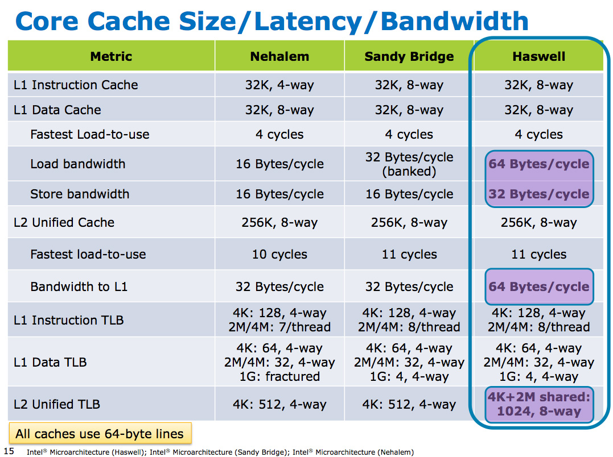
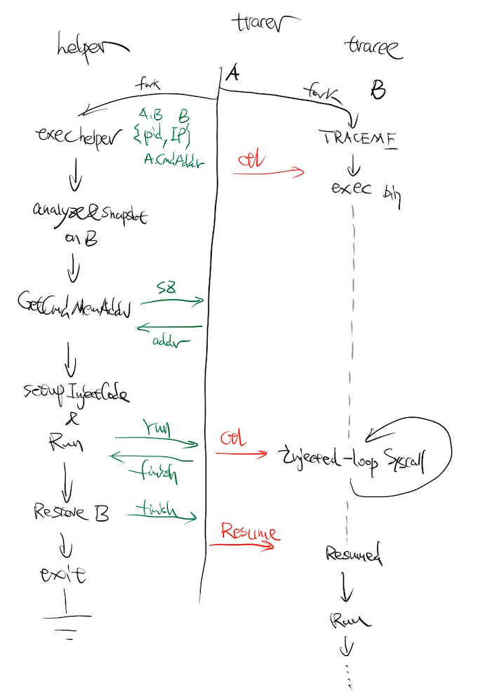

# TiExec

## 介绍

### 用法

```bash
$ tiexec echo -e "Hi, I am loaded by tiexec ❤️\nIt may try to make me more performant ☺\n"
Hi, I am loaded by tiexec ❤️
It may try to make me more performant ☺

$ tiexec go version
go version go1.16.4 linux/amd64

$ tiexec rustc -V
rustc 1.55.0 (c8dfcfe04 2021-09-06)

$ tiexec bin/pd-server ...
$ tiexec bin/tidb-server ...
$ tiexec bin/tikv-server ...
$ tiexec bin/tiflash/tiflash ...

$ # or even any elf you like
$ tiexec bin/prometheus/prometheus ...
$ tiexec bin/bin/grafana-server ...
```

### 简介

TiExec 会尝试缓解其所加载应用程序在未来执行时可能面临的 iTLB-Cache-Miss 问题，因此会为那些正在遭受 iTLB-Cache-Miss 惩罚的应用程序带来一定的直接性能提升，比如，在 TiDB 的某 OLTP 场景下对部分组件通过 TiExec 优化之后的测试显示能带来约 6-11% 的整体性能提升。

## 作者

Sen Han (韩森) 00hnes@gmail.com

## 进展

> 2021.12.28

已经完成原型开发，在 TiDB 的某 OLTP 场景下对 tidb-server 和 tikv-server 进行优化之后的初步测试结果显示能带来约 6-11% 的整体性能提升，后续会进一步尝试对集群中的 PD 和 TiFlash 组件二进制进行优化以进行更全面的性能测试，同时也会继续 TiExec 的开发，尝试把优化更进一步并提供更全面的功能，最终达到生产级别。

## 背景 & 动机

大约三个月之前，在对 TiDB 进行性能优化的过程中，发现：

* 从 CPU 的角度来看，无论是 tidb-server 进程还是 tikv-server 进程，两者都是 memory bound 的应用，两者 [CPU IPC](https://www.intel.com/content/www/us/en/develop/documentation/vtune-help/top/reference/cpu-metrics-reference/ipc.html) 值都很低，这说明大部分时间两者的 CPU 都在等待（这种 CPU 级别的等待在当前微处理器架构下内核无法介入），其中 tidb-server 要比 tikv-server 更严重

* 无论是 tidb-server 进程还是 tikv-server 进程都有比较严重的 iTLB-Cache-Miss 问题，其中 tidb-server 要比 tikv-server 更严重，这一问题的根源是因为两者 binary 中的 .text 段都比较大，而一般 CPU 的 iTLB 资源都比较有限。对于大多数拥有大 .text 段的程序来说，这其实是一个非常常见的问题



下面是某一版本 TiDB 组件中一些 binary 的 .text 段大小示例（不包含运行时所加载动态链接库的 .text 部分）

```
text of bin tiflash: 
	160,049,257 Bytes
text of bin tidb
	 78,573,636 Bytes
text of bin pd
	 58,501,988 Bytes
text of bin tikv
 	 45,685,006 Bytes
```

顺着这一思路，当时尝试了 TiKV PGO（[Profile Guided Optimization of rustc](https://doc.rust-lang.org/rustc/profile-guided-optimization.html)），结果显示大约能带来约 3% 的总体性能提升，但这种类型的优化需要编译器的支持，而 Golang 编译器目前并不提供这种类型的优化支持，所以当时我就有一个想法：可以专门针对大 .text 段通过 HugePage 做内存映射，这样对应用就是无侵入的，针对所有程序都适用。但后来由于其他原因，对这一优化想法的探索临时放下了脚步。

三个月之后的现在，正好可以借着 Hackathon 的机会继续之前的探索。

## 项目设计

第一个思考的实现方案，可以通过修改内核 exec syscall 的实现来达到这一目的，这也是最直接了当的方法之一，但是这种方式会带来额外的部署要求和成本。我们更希望在用户空间完成这一目标，能够方便地运维部署，最好能无侵入，不需要应用做代码改动。

尝试的第二个实现方案，实现一个用户空间版本的 exec "syscall"，这样，我们就可以在给 .text 做 mmap 的时候自适应地尽可能多的映射到 HugePage。

于是在一个名为 [userlandexec](https://github.com/bediger4000/userlandexec) 的开源项目基础上增加了这一优化实现，实测结果显示：在只针对 tidb-server 的 binary 进行 exec 优化的情况下，TiDB 在某 OLTP 场景性能提升约 4.2%，tidb-server 的 iTLB-Cache-Miss 率降低约 31%。

这是很好的结果，意味着这个探索方向是有价值的。但是 userlandexec 在运行 tikv-server 的时候存在 bug，要尝试解决这个问题，就需要花足够的时间学习了解 linux exec 的详细流程以对 userlandexec 进行 debug 和 fix，但是因为 Hackathon 的时间比较有限，于是决定暂时放弃这一方案去寻找更好的解法。

第三个尝试的实现方案，也就是当前原型的最终实现。

除了在 setup 进程空间时做我们想要的 mmap 优化，能不能先让内核帮我们把 exec 的脏活累活全部做完，然后我们再对进程空间里的 text 做 re-mmap 呢？这样就可以把我们想做的优化和内核的能做的部分给解耦开。



上图即为最终的实现，中间为 tracer，左侧为 helper，右侧为我们想要优化的任意 elf 程序，称之为 tracee。核心思想是 tracer 通过借助 [ptrace](https://man7.org/linux/man-pages/man2/ptrace.2.html) 和其他 syscall 控制 tracee 的执行、暂停以及控制其寄存器的值（即等于可以控制 tracee 做任何我们想让它做的事情），helper 通过 `/proc/$pidOfTracee/(maps)|(numa_maps)|(mem)` 等内核提供的接口对 tracee 做内存布局分析、内存备份、控制指令生成与载入、页面 re-mmap、内存恢复等操作。

欢迎阅读 [README](README.md) 中的使用文档和试用。
